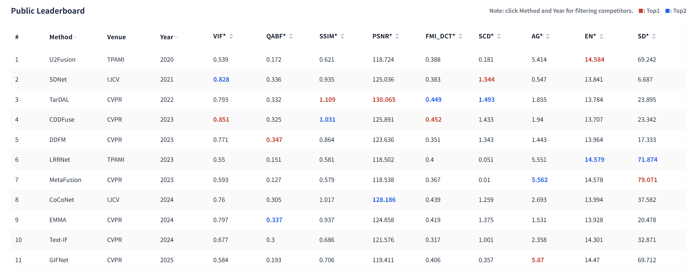

# EvaNet [TPAMI 2026] 
This is the offical implementation for the paper titled "EvaNet: Towards More Efficient and Consistent Infrared and Visible Image Fusion Assessment"([Arxiv](https://arxiv.org/abs/2604.02896), [Paper](https://ieeexplore.ieee.org/document/11477151)).

---

###  Announcement
- Apr 03, 2026 Our paper has been accepted by IEEE Transactions on Pattern Analysis and Machine Intelligence (TPAMI).
- Apr 14, 2026 The online evaluation platform **EvaJudge** is now available: 👉 http://evanet.online:5001
- Apr 21, 2026 Results of TDFusion (CVPR 2025) have been added to the Public Leaderboard.
- Apr 21, 2026 (v1.1.3) Support visualization: click a method name to view its fusion examples.

---
###  EvaJudge Usage

EvaJudge is an online evaluation platform for infrared and visible image fusion, powered by EvaNet. It enables **fast, consistent, and zero-setup evaluation** of fusion results.

 *You are welcome to submit your papers, results, and model weights for inclusion in the Public Leaderboard*.
 
 📮Email: chunyang_cheng@jiangnan.edu.cn ☎️WeChat: chengchunyang2016

<div align="center">
  
</div>

#### 🔹 How to Use
1. Register an account [here](http://evanet.online:5001/#/register).
2. Log in and select a dataset (e.g., LLVIP, MSRS).
3. Upload your fusion results as a `.zip` file.
4. The system will automatically evaluate your results and return a full set of metrics within seconds.

#### 🔹 Submission Format
- The uploaded file must be a `.zip` archive.
- The archive should contain **only fused images** (no subfolders).
- File names must correspond to the dataset image indices (e.g., `1.jpg`, `2.jpg`, ..., `N.jpg`).

#### 🔹 Registration Policy
- Registration is restricted to **institutional (organization-affiliated) email addresses only**  (e.g., university or company domains).  


###  Citation
If this work is helpful to you, please cite it as:
```
@article{ChengEvaNetTPAMI2026,
  author={Cheng, Chunyang and Xu, Tianyang and Wu, Xiao-Jun and Zhou, Tao and Li, Hui and Tang, Zhangyong and Kittler, Josef},
  journal={IEEE Transactions on Pattern Analysis and Machine Intelligence}, 
  title={EvaNet: towards More Efficient and Consistent Infrared and Visible Image Fusion Assessment}, 
  year={2026},
  volume={},
  number={},
  pages={1-18},
  keywords={Image fusion;quality assessment;efficient;unified;large language model},
  doi={10.1109/TPAMI.2026.3681958}}
```
